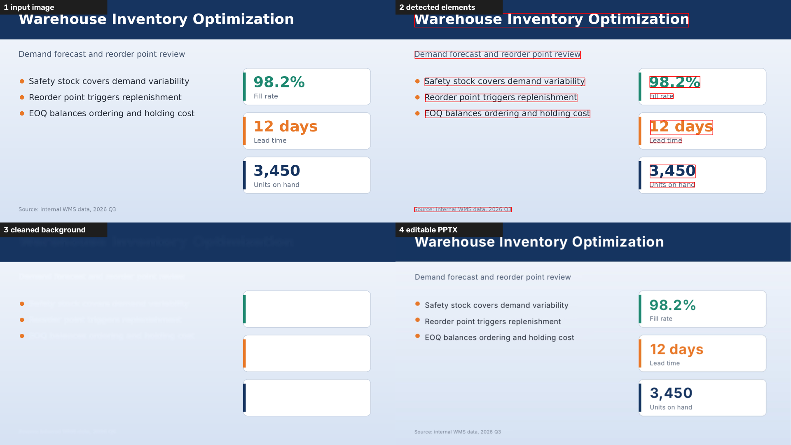

# img2pptx · 图片转可编辑 PPT

把一张幻灯片**图片**（比如 AI 生成的信息图、截图）还原成**可以编辑的 PPTX**：文字变成真正的文本框，图标和配图变成可以单独移动的图片，剩下的部分作为干净的背景。

全部在本机运行，图片不会上传到任何地方。



## 它做了什么

1. **识别文字**：OCR 得到每行文字的内容和位置，再量出颜色、字号、粗细、斜体、字距。
2. **抠出元素**：图标、照片、组合插画、圆形序号各自抠成透明背景的独立图片；每个候选逐项打分，分数不够的留在背景里。
3. **补全背景**：把文字和抠走的东西从原图上抹掉。纯色和渐变背景直接算出颜色，复杂背景用 LaMa 模型补全。
4. **重建 PPT**：干净的背景做底图，叠上独立图片和文本框。

转换完成后可以在网页里**手动调整**：识别得不对的框可以改大小、删除、补画，然后按修改重新生成。

## 安装和使用

需要 Python 3.9 – 3.12。

**双击启动（推荐）**

- Windows：双击 `Windows-start.bat`
- macOS：双击 `Mac-start.command`

第一次运行会自动安装依赖并下载背景补全模型（约 200 MB），需要联网；之后直接启动，浏览器会打开 `http://127.0.0.1:8765`。

**手动安装**

```bash
python -m venv .venv
.venv/bin/pip install -r requirements.txt        # Windows: .venv\Scripts\pip
.venv/bin/python app.py                          # 网页界面
.venv/bin/python img2pptx.py slide.png -o out.pptx   # 命令行
```

命令行常用参数：`--debug` 输出中间结果图，`--inpaint telea` 用快速算法，`--no-icons` / `--no-pictures` 不抠图标 / 配图。

背景补全模型放在 `models/lama_fp32.onnx`，说明见 [models/README.md](models/README.md)。没有模型也能运行，只是复杂背景上会比较糊。

## 适用范围和已知限制

请先看这一节再决定要不要用。

- **只在少量图片上调过**。目前的规则是在几张中文信息图（浅色卡片式版面、绿色和蓝色主题）上调出来的，都是基于规则的图像处理，没有训练模型。换一种版面风格，效果很可能明显变差。
- **适合**：版面规整、背景干净、文字清晰的幻灯片图片，宽度 1400 像素以上。
- **不适合**：手写体、艺术字、文字压在复杂照片上的页面、低分辨率截图。
- **字体不会还原**：文本框统一用微软雅黑，字宽和原图有差异，靠字距和字号微调来贴合。
- **形状不会还原成矢量**：色带、卡片、箭头等留在背景图里或抠成位图，不是 PPT 自带的形状。
- **渲染只在 LibreOffice 下检查过**，PowerPoint 和 WPS 里的字宽可能略有不同。
- **Windows 启动脚本没有在真机上测试过**，遇到问题欢迎提 issue。
- 网页服务只监听本机 `127.0.0.1`，没有登录和限流，**不要直接暴露到公网**。

## 文件说明

| 文件 | 作用 |
|---|---|
| `img2pptx.py` | 转换核心，也可以单独当命令行工具用 |
| `app.py` | 本地网页服务（只用 Python 标准库） |
| `index.html` | 网页界面 |
| `Mac-start.command` / `Windows-start.bat` | 一键安装并启动 |

## 致谢

- 文字识别：[RapidOCR](https://github.com/RapidAI/RapidOCR)（Apache-2.0）
- 背景补全：[LaMa](https://github.com/advimman/lama)（Apache-2.0），使用 [Carve/LaMa-ONNX](https://huggingface.co/Carve/LaMa-ONNX) 的 ONNX 版本
- [OpenCV](https://opencv.org/)、[python-pptx](https://github.com/scanny/python-pptx)、[Pillow](https://python-pillow.org/)、NumPy、ONNX Runtime

模型文件不包含在本仓库中，由启动脚本从上游下载。

## 协议

[MIT](LICENSE)
